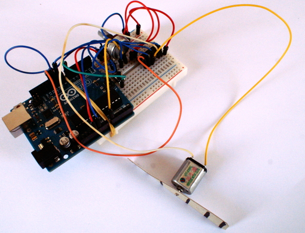

#Wstêp

<figure>

<figcaption>Sterownik silnika DC</figcaption>
</figure>

Czêœæ z nas w swoich projektach planuje u¿ycie ma³ych silników DC. Mo¿na siê z nimi spotkaæ w zabawkach, ma³ych modelarskich wiertarkach, czy na gie³dach elektronicznych gdzie le¿¹ ich niekiedy ca³e kartony. Oczywiœcie najproœciej jest pod³¹czyæ taki silniczek do baterii b¹dŸ zasilacza, dorzuciæ œmigie³ko i cieszyæ ch³odnym powiewem œwie¿ego powietrza. Do tego celu u¿yjemy uk³adu L293D. 
Co jeœli byœmy chcieli, aby taki nasz wiatraczek krêci³ siê z ró¿nymi prêdkoœciami obrotowymi, albo myœlimy nad zrobieniem urz¹dzenia dmuchaj¹cego b¹dŸ wysysaj¹cego dym b¹dŸ inne opary.

##Rozwi¹zania

Jak zawsze mo¿emy siêgn¹æ po gotowe rozwi¹zania, zap³aciæ ekipie za monta¿ i cieszyæ siê z nowego nabytku. Mo¿e by jednak spróbowaæ samemu zrobiæ taki sterownik. Z pomoc¹ przyjdzie nam oczywiœcie niezawodne Arduino i parê elementów. Dla ma³ych silniczków, tzn. dla silniczków o ma³ym poborze pr¹du mo¿emy wykorzystaæ tranzystor 2N2222 b¹dŸ, a dla wiêkszego pr¹du uk³ad L293D. Do tego dorzucimy sobie potencjometr, jakiœ przycisk, opornik i diodê 1N4001.

##L293D

Zacznijmy od wiêkszego kalibru, czyli od uk³adu L293D. Na nim zrobimy prosty sterownik, w którym prêdkoœæ bêdzie regulowana za pomoc¹ potencjometru, a po naciœniêciu przycisku, nasz silnik zmieni kierunek obrotu. Aby nie wywa¿aæ otwartych drzwi, skorzystamy z gotowego kodu i pomys³u stworzonego przez Adafruita. Oczywiœcie zachêcamy do zag³êbiania siê w schematy, noty katalogowe i do przegl¹dania stron internetowych, poniewa¿ nie zawsze mo¿emy znaleŸæ gotowe rozwi¹zanie, b¹dŸ znalezione rozwi¹zanie nie spe³nia naszych oczekiwañ. W tym przypadku mamy gotowy projekt, który w póŸniejszym czasie ka¿dy z powodzeniem jest w stanie dopasowaæ do w³asnych potrzeb.
