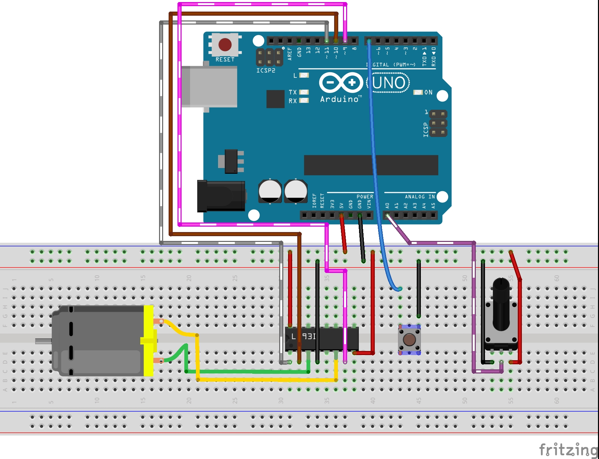
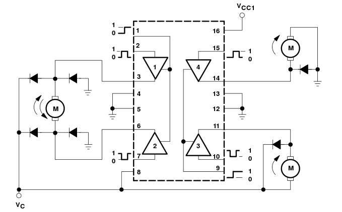

#Schemat

<figure>

<figcaption>Schemat sterownika silnika DC</figcaption>
</figure>

Tak jak wspomnia³em wczeœniej nie potrzeba wielu elementów. Uk³ad L293D bêdzie naszym sterownikiem odpowiedzialnym za prêdkoœæ obrotow¹ oraz kierunek obrotów. Potencjometrem bêdziemy regulowaæ nasze obroty, a przycisk bêdzie s³u¿y³ do zmiany kierunku. Osoby które mia³y ju¿ doœwiadczenie z silnikami mog¹ zwróciæ uwagê na brak diody. Oczywiœcie w powy¿szym przypadku na jednej diodzie by siê to nie skoñczy³o, poniewa¿ silnik ma siê obracaæ w obydwu kierunkach. Z pomoc¹ nam przyjdzie nota katalogowa od L293 i poni¿szy schemat:

<figure>

<figcaption>Uk³ad L293</figcaption>
</figure>

Po lewej stronie widaæ silnik, który krêci siê w dwie strony, natomiast po prawej silniki krêc¹ce siê w jednym kierunku. Widzicie ró¿nicê w iloœci diód? To dlatego, ¿e taka dioda ma za zadanie przepuszczaæ zasilanie tylko w jednym kierunku i zapobiega powstania impulsu zwrotnego po zatrzymaniu silnika. Dla naszego silnika zrobiony zosta³ mostek prostowniczy, dlatego , ¿e nasz silnik bêdzie siê krêci³ w obydwu kierunkach. 

Pamiêtajmy, ¿e uk³ad L293D posiada wbudowane diody chroni¹ce tranzystory mostka H. Tu warto zajrzeæ do noty katalogowej dla uk³adu L293D, a nie L293.

<figure>

<figcaption>Uk³ad L293D</figcaption>
</figure>

Wracaj¹c do naszego przyk³adu, pod³¹czamy wszystko tak jak na schemacie, a nastêpnie przechodzimy do wgrywania kodu.