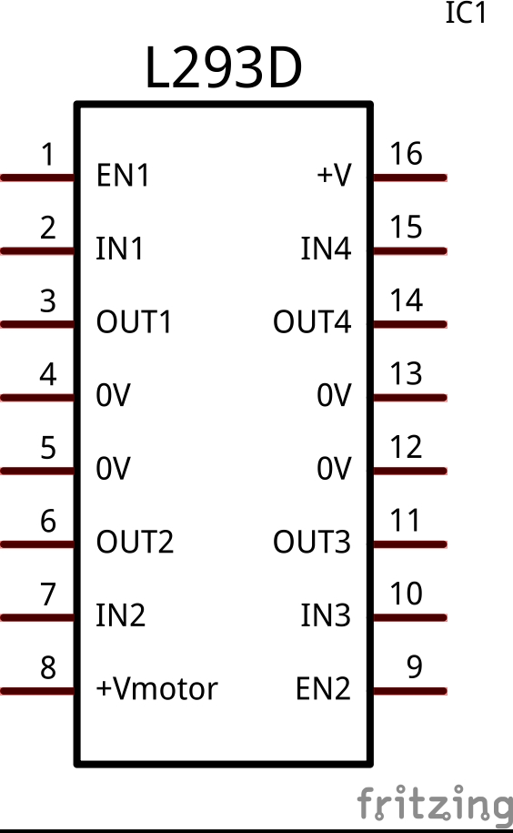

#Podsumowanie

<figure>

<figcaption>Uk³ad L293D-piny</figcaption>
</figure>

Uk³ad L293D posiada dwa piny +V (8 i 16). Pin nr.8 (+Vmotor) odpowiada za doprowadzenie zasilania do silników, natomiast pin 16 (+V) do logiki uk³adu. Oba te piny pod³¹czyliœmy do pinu +5V w Arduino. Jeœli jednak macie zamiar u¿yæ mocniejszego silnika, b¹dŸ na wiêksze zasilanie, zalecane jest, aby pin 8 pod³¹czony by³ do zewnêtrznego zasilacza, a masy zasilacza oraz Arduino by³y po³¹czone ze sob¹.

<figure>

<figcaption>Uruchomiony projekt</figcaption>
</figure>

##Odnoœniki

- [Uk³ad L293D w Nettigo](http://nettigo.pl/products/113)
- [Nota katalogowa uk³adu L293D](L293D.pdf)